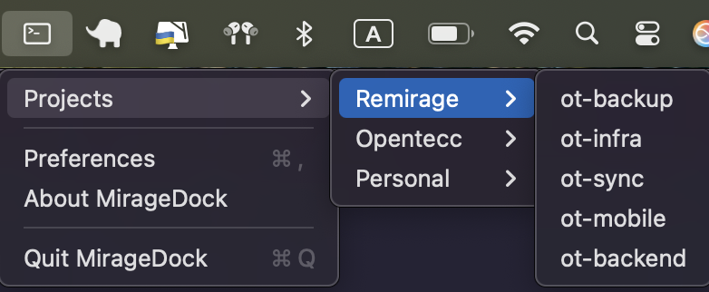

# MirageDock

A beautiful, modern macOS menu bar app for managing coding projects and repositories with multi-editor support. Built with Swift, SwiftUI, and AppKit.



## ✨ Features

### 🎯 Multi-Editor Support

-   **VS Code** - Microsoft's popular code editor
-   **Cursor** - AI-powered code editor
-   **Sublime Text** - Fast and lightweight editor
-   **Atom** - Hackable text editor
-   **Vim/Neovim** - Terminal-based editors
-   **JetBrains IDEs** - IntelliJ, WebStorm, PhpStorm, PyCharm
-   **Xcode** - Apple's development IDE
-   **Custom Editors** - Support for any command-line editor

### 🎨 Modern UI

-   **Beautiful Settings Interface** - Categorized editor selection with hover effects
-   **Smart Detection** - Automatically detects installed editors
-   **Full-Area Interaction** - Click anywhere on editor cards
-   **Responsive Design** - Works on all macOS screen sizes
-   **Custom Icons** - Professional app branding

### 📁 Project Management

-   **Organize by Projects** - Group repositories logically
-   **Repository Management** - Add, edit, and delete repositories
-   **Path Validation** - Real-time folder path checking
-   **Menu Bar Integration** - Always accessible from menu bar

### 🔧 Technical Features

-   **Sandbox Compatible** - Works in both development and production
-   **Smart Fallbacks** - App integration → Command line → Finder
-   **Data Persistence** - Projects saved locally with UserDefaults
-   **Modern Architecture** - SwiftUI + AppKit with MVVM pattern

## 🚀 Quick Start

### Download Latest Release

1. Go to [Releases](https://github.com/yourusername/MirageDock/releases)
2. Download `MirageDock.dmg`
3. Drag MirageDock to Applications
4. Launch and configure your preferred editor

### From Source

```bash
# Clone the repository
git clone https://github.com/yourusername/MirageDock.git
cd MirageDock

# Build and run
swift build
swift run

# Or create app bundle
swift build --configuration release
./create_app.sh
```

## 📦 Installation

### Requirements

-   macOS 13.0 (Ventura) or later
-   Your preferred code editor (optional)

### Setup Steps

1. **Download** the latest release from GitHub
2. **Install** by dragging to Applications folder
3. **Launch** MirageDock from Applications or Spotlight
4. **Configure** your preferred editor in Settings
5. **Add Projects** and repositories to get started

## 🎯 Usage

### First Launch

1. MirageDock appears in your menu bar as a terminal icon
2. Click the icon to see the dropdown menu
3. Select "Preferences" to start adding projects

### Managing Projects

1. In Preferences, click "Add Project" to create a new project
2. Give your project a name
3. Add repositories by clicking "Add Repository"
4. Use "Browse" to select folder paths
5. Repository names auto-fill from folder names

### Opening Repositories

1. Click the menu bar icon
2. Navigate to Projects → [Your Project] → [Repository]
3. Click on a repository to open it in your selected editor

### Configuring Editors

1. Open Settings from the sidebar
2. Choose your preferred editor from the categorized list
3. For custom editors, select "Custom Editor" and enter the command
4. Settings are automatically saved

## 🛠️ Development

### Prerequisites

-   Xcode 15.0 or later
-   macOS 13.0 or later
-   Swift 5.9

### Building from Source

```bash
# Clone repository
git clone https://github.com/yourusername/MirageDock.git
cd MirageDock

# Build debug version
swift build

# Run in development
swift run

# Build release version
swift build --configuration release

# Create app bundle
./create_app.sh
```

### Project Structure

```
MirageDock/
├── MirageDockApp.swift          # Main app entry point
├── Models/
│   └── Project.swift            # Data models and editor definitions
├── Managers/
│   └── ProjectManager.swift     # Business logic and persistence
├── MenuBar/
│   └── MenuBarManager.swift     # Menu bar integration
├── Views/
│   ├── PreferencesView.swift    # Main preferences window
│   ├── SettingsView.swift       # Editor settings interface
│   ├── ProjectDetailView.swift  # Project management
│   ├── AddProjectView.swift     # New project creation
│   ├── AddRepositoryView.swift  # New repository addition
│   └── EditRepositoryView.swift # Repository editing
├── Package.swift                # Swift Package Manager config
├── create_app.sh               # App bundle creation script
├── logo.icns                   # Custom app icon
└── README.md                   # This file
```

### Architecture

-   **SwiftUI** - Modern declarative UI framework
-   **AppKit** - Menu bar integration via NSStatusBar
-   **MVVM** - Model-View-ViewModel architecture
-   **ObservableObject** - Reactive data flow
-   **UserDefaults** - Local data persistence

## 🔧 Configuration

### Editor Integration

MirageDock supports multiple integration methods:

1. **App Integration** - Direct folder opening with editor app
2. **Command Line** - Uses editor's CLI tool as fallback
3. **Finder Fallback** - Opens in Finder as last resort

### Supported Editors

| Editor       | Bundle ID                       | Command      | Status |
| ------------ | ------------------------------- | ------------ | ------ |
| VS Code      | `com.microsoft.VSCode`          | `code`       | ✅     |
| Cursor       | `com.todesktop.230313mzl4w4u92` | `cursor`     | ✅     |
| Sublime Text | `com.sublimetext.4`             | `subl`       | ✅     |
| Atom         | `com.github.atom`               | `atom`       | ✅     |
| Vim          | `org.vim.MacVim`                | `vim`        | ✅     |
| Neovim       | `io.neovim.nvim`                | `nvim`       | ✅     |
| IntelliJ     | `com.jetbrains.intellij`        | `idea`       | ✅     |
| WebStorm     | `com.jetbrains.WebStorm`        | `webstorm`   | ✅     |
| PhpStorm     | `com.jetbrains.PhpStorm`        | `phpstorm`   | ✅     |
| PyCharm      | `com.jetbrains.PyCharm`         | `pycharm`    | ✅     |
| Xcode        | `com.apple.dt.Xcode`            | `xed`        | ✅     |
| Custom       | -                               | User-defined | ✅     |

## 🤝 Contributing

### Development Setup

1. Fork the repository
2. Create a feature branch: `git checkout -b feature/amazing-feature`
3. Make your changes
4. Test thoroughly
5. Commit: `git commit -m 'Add amazing feature'`
6. Push: `git push origin feature/amazing-feature`
7. Open a Pull Request

### Guidelines

-   Follow Swift style guidelines
-   Add tests for new features
-   Update documentation
-   Ensure sandbox compatibility
-   Test on different macOS versions

## 📝 Changelog

### v1.0.0

-   ✨ Initial release
-   🎨 Modern Settings UI with categorized editor selection
-   🔧 Multi-editor support (VS Code, Cursor, Sublime, etc.)
-   🎯 Smart editor detection and fallback system
-   📱 Menu bar integration
-   🛡️ Sandbox compatibility
-   🎨 Custom app icon support
-   🖱️ Full-area card interaction
-   📁 Project and repository management

## 📄 License

This project is licensed under the MIT License - see the [LICENSE](LICENSE) file for details.

## 🙏 Acknowledgments

-   Built with SwiftUI and AppKit
-   Icons from SF Symbols
-   Inspired by modern macOS development tools

## 📞 Support

-   **Issues**: [GitHub Issues](https://github.com/yourusername/MirageDock/issues)
-   **Discussions**: [GitHub Discussions](https://github.com/yourusername/MirageDock/discussions)
-   **Releases**: [GitHub Releases](https://github.com/yourusername/MirageDock/releases)

---

**Made with ❤️ for the macOS developer community**
